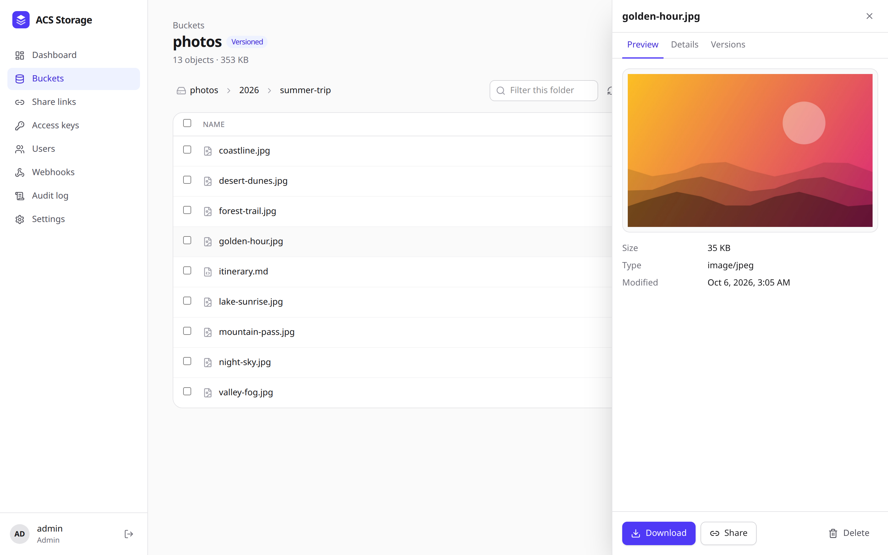
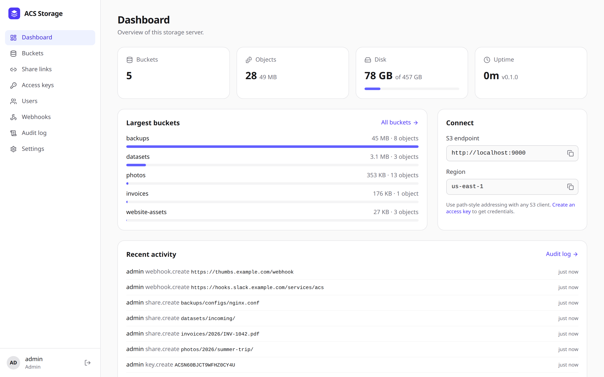
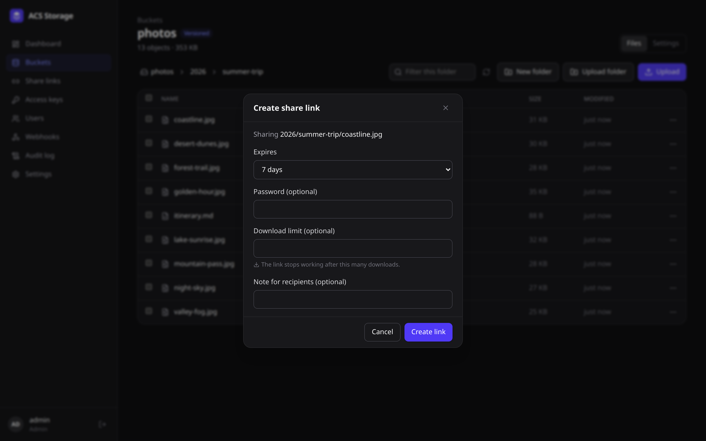
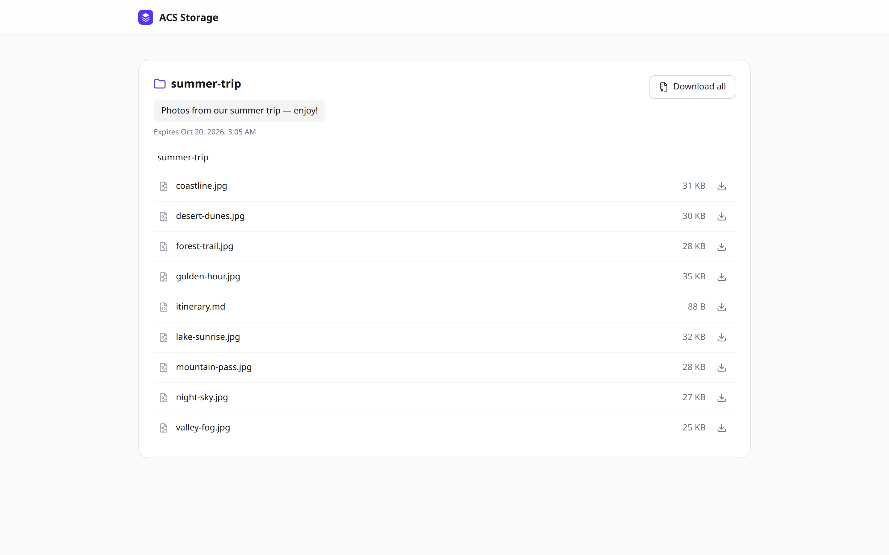
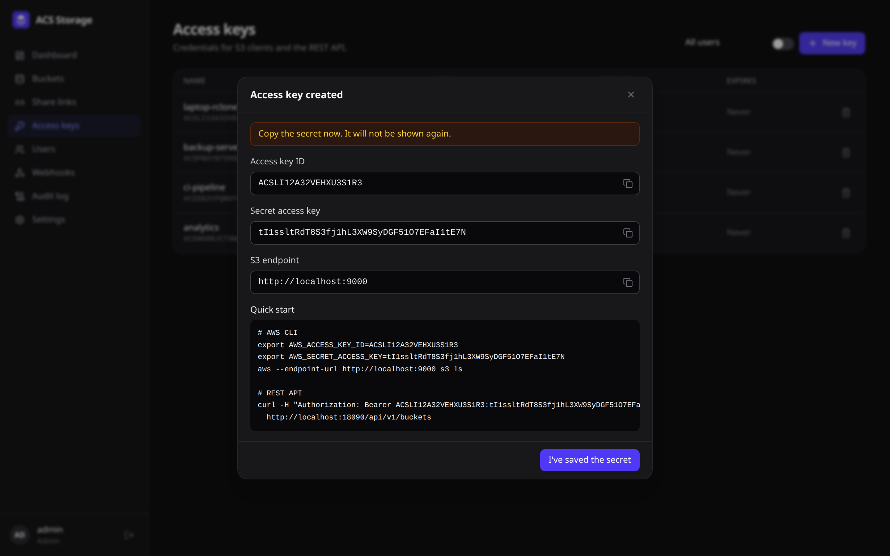
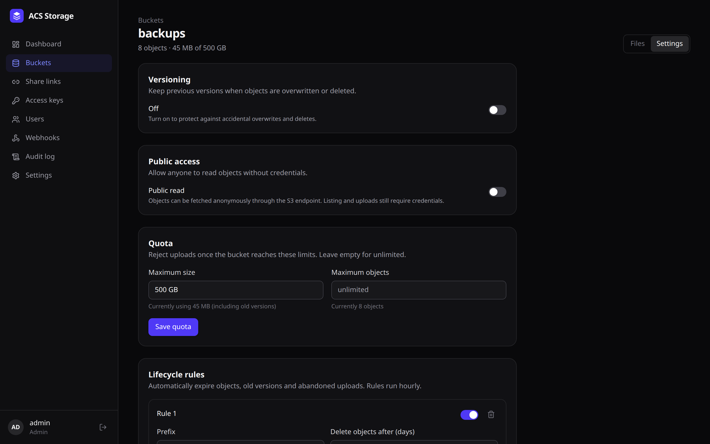
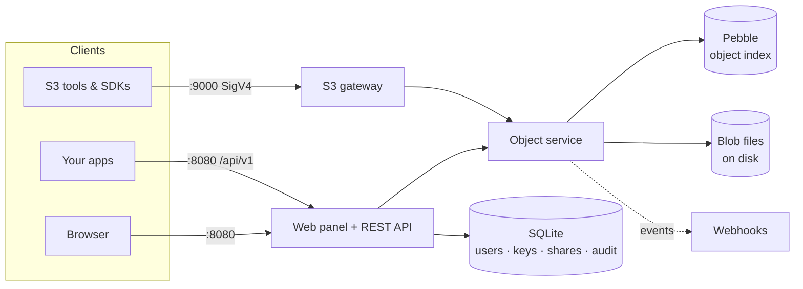

<div align="center">


# ACS

### Your own S3 — with a panel you'll actually enjoy using.

Self-hosted, S3-compatible object storage with a beautiful web panel, share links, file requests, webhooks and a REST API.<br/>
One container. One command. MIT licensed.

[](https://github.com/StrStark/acs/actions/workflows/ci.yml)
[](LICENSE)
[](go.mod)
[](#-s3-compatibility)
[](Dockerfile)

[**Quick start**](#-quick-start) · [**Features**](#-features) · [**S3 compatibility**](#-s3-compatibility) · [**API**](#-rest-api--webhooks) · [**Roadmap**](#-roadmap)

<br/>

<picture>
  <source media="(prefers-color-scheme: dark)" srcset="docs/images/browser-dark.png" />
  
</picture>

</div>

---

## ✨ Why ACS?

Most self-hosted S3 servers give you a fast storage engine and leave everything else to you. ACS ships the whole product:

- 🪣 **A real S3 server**: its own storage engine with versioning, multipart uploads, lifecycle rules and quotas. Works with the AWS CLI, rclone, boto3 and every S3 SDK.
- 🖥️ **A complete admin panel in the open-source build**, not an upsell: file browser, previews, users, roles, access keys, webhooks, audit log.
- 🔗 **Sharing built in**: public links with passwords, expiry and download limits, plus **file requests** that let anyone upload to you without seeing anything else.
- 🔌 **Made to integrate**: a documented REST API (OpenAPI 3.1), signed webhooks and Prometheus metrics.
- 📦 **Tiny and simple**: a single static Go binary with the panel embedded. The image is about 36 MB, built `FROM scratch`. `docker compose up -d` and you're done.

## 🚀 Quick start

```bash
git clone https://github.com/StrStark/acs && cd acs
docker compose up -d
```

Open **http://localhost:8080**, create your admin account, and you're in. The S3 API listens on **http://localhost:9000**.

Create an access key in the panel (**Access keys → New key**), then use any S3 tool:

```bash
export AWS_ACCESS_KEY_ID=ACS...  AWS_SECRET_ACCESS_KEY=...
aws --endpoint-url http://localhost:9000 s3 mb s3://photos
aws --endpoint-url http://localhost:9000 s3 sync ~/Pictures s3://photos/
```

> [!IMPORTANT]
> Until the first admin account exists, anyone who can reach port 8080 can create it. Finish setup right away, or set `ACS_SETUP_TOKEN` when the port is exposed.

## 🧩 Features

<table>
<tr>
<td width="50%" valign="top">

### Dashboard
Totals, disk usage, largest buckets, connection details and recent activity at a glance.

</td>
<td width="50%" valign="top">

<picture>
  <source media="(prefers-color-scheme: dark)" srcset="docs/images/dashboard-dark.png" />
  
</picture>

</td>
</tr>
<tr>
<td valign="top">



</td>
<td valign="top">

### Share links & file requests
Share a file or a whole folder with **expiry**, **password** and **download limits**, or create an **upload-only link** so clients can send you files. Views and downloads are tracked; disable a link with one click.

</td>
</tr>
<tr>
<td valign="top">

### Beautiful public pages
Recipients get a clean page with previews, per-file downloads and **"Download all" as ZIP**, with no account needed.

</td>
<td valign="top">



</td>
</tr>
<tr>
<td valign="top">



</td>
<td valign="top">

### Scoped access keys
Read-only, read-write or full access, limited to specific buckets, with optional expiry. Every new key comes with copy-paste snippets for the AWS CLI and the REST API.

</td>
</tr>
<tr>
<td valign="top">

### Per-bucket controls
Versioning, public read access, quotas, lifecycle rules and CORS, all from the panel or the S3 API.

</td>
<td valign="top">



</td>
</tr>
</table>

<details>
<summary><b>Full feature list</b></summary>

**Storage engine**
- Buckets and objects on local disk, with Pebble (LSM) metadata; small objects are stored inline
- Multipart uploads, range reads, server-side copy, instant rename/move
- Versioning (enable/suspend), delete markers, restore any version
- Lifecycle: expire objects, prune noncurrent versions, abort stale multipart uploads
- Quotas (bytes and object count) with live usage stats
- Crash-safe writes (fsync and atomic rename), background garbage collection and an orphan scrubber

**Web panel**
- Drag-and-drop uploads of files *and folders*; large files upload in parallel 16 MB parts with progress and cancel
- Previews for images, video, audio, PDF and text; metadata and tag editor
- Bulk select → move, delete, download as ZIP
- Roles: **viewer** (browse and download), **editor** (upload, share, manage buckets), **admin** (everything)
- Webhooks with delivery log and test button, a searchable audit log, server settings
- Light and dark themes, responsive down to mobile

**Security**
- Argon2id passwords, HttpOnly SameSite session cookies, CSRF protection
- Access-key and webhook secrets encrypted at rest (AES-GCM with a master key)
- Uploaded content is served with a sandboxing CSP, so a malicious HTML or SVG upload can't run script in the panel
- Login, setup and share-password rate limiting
- Runs as a non-root user in a `scratch` image

</details>

## 🔁 S3 compatibility

Every release is tested against real clients, not mocks (`test/e2e/run_all.sh`):

| Client | What's tested |
|---|---|
| **AWS CLI v2** | buckets, put/get, 23 MB multipart, sync, recursive ls/rm, ranged GET, metadata, tagging, copy/move, presigned URLs, versioning, batch delete |
| **boto3** | CRC32/SHA1/SHA256 checksums, managed multipart transfer, conditional writes (`If-None-Match: *`), 304s, v1/v2 pagination, CORS + preflight, lifecycle, versioning, presigned PUT |
| **rclone** | sync up/down with multipart and Unicode names, `check --download`, purge |

<details>
<summary><b>Supported operations</b></summary>

| Area | Operations |
|---|---|
| Auth | SigV4 header, presigned URLs (GET/PUT), `aws-chunked` streaming with signed chunks and trailing checksums, anonymous reads on public buckets |
| Buckets | Create, Delete, Head, List, GetBucketLocation, Get/PutBucketVersioning, Get/Put/DeleteBucketCors, Get/Put/DeleteBucketLifecycleConfiguration, GetBucketAcl, GetBucketPolicyStatus |
| Objects | Get (Range, `partNumber`, conditional headers, `response-*` overrides), Head, Put (Content-MD5, checksums, `If-None-Match`/`If-Match`), Copy (metadata/tagging directives, copy-source conditions), Delete, DeleteObjects, Get/Put/DeleteObjectTagging |
| Listing | ListObjects, ListObjectsV2 (continuation tokens, `start-after`, `encoding-type=url`), ListObjectVersions |
| Multipart | Create, UploadPart, UploadPartCopy, Complete, Abort, ListParts, ListMultipartUploads |
| Addressing | Path-style (default) and virtual-hosted style via `ACS_S3_DOMAIN` |

Not implemented yet: bucket policies, object lock/retention, server-side encryption headers, S3 Select.
</details>

### Use it from your code

<details>
<summary><b>rclone</b></summary>

```ini
[acs]
type = s3
provider = Other
endpoint = http://localhost:9000
access_key_id = ACS...
secret_access_key = ...
force_path_style = true
```
</details>

<details>
<summary><b>Python (boto3)</b></summary>

```python
import boto3

s3 = boto3.client("s3", endpoint_url="http://localhost:9000",
                  aws_access_key_id="ACS...", aws_secret_access_key="...")
s3.upload_file("report.pdf", "docs", "2026/report.pdf")
url = s3.generate_presigned_url("get_object", Params={"Bucket": "docs", "Key": "2026/report.pdf"}, ExpiresIn=3600)
```
</details>

<details>
<summary><b>JavaScript (AWS SDK v3)</b></summary>

```js
import { S3Client, PutObjectCommand } from "@aws-sdk/client-s3";

const s3 = new S3Client({
  endpoint: "http://localhost:9000",
  region: "us-east-1",
  forcePathStyle: true,
  credentials: { accessKeyId: "ACS...", secretAccessKey: "..." },
});
await s3.send(new PutObjectCommand({ Bucket: "docs", Key: "hello.txt", Body: "Hello!" }));
```
</details>

## 🔌 REST API & webhooks

Everything in the panel is available over a REST API, documented in [`openapi.yaml`](internal/api/openapi.yaml) (also served at `/api/v1/openapi.yaml`). Authenticate with an access key:

```bash
KEY="Authorization: Bearer $AWS_ACCESS_KEY_ID:$AWS_SECRET_ACCESS_KEY"

# Upload a file with a raw PUT
curl -H "$KEY" -T invoice.pdf http://localhost:8080/api/v1/buckets/docs/objects/2026/invoice.pdf

# Create a password-protected link that expires in a week
curl -H "$KEY" -H 'Content-Type: application/json' http://localhost:8080/api/v1/shares -d '{
  "type": "file", "bucket": "docs", "key": "2026/invoice.pdf",
  "password": "s3cret", "maxDownloads": 5, "expiresAt": "2026-12-31T00:00:00Z"
}'
```

**Webhooks** fire on `object.created`, `object.deleted`, `bucket.created`, `bucket.deleted`, `share.created`, `share.downloaded` and `share.uploaded`. Each delivery is signed and retried with exponential backoff:

```js
// Verify an ACS webhook (Node.js)
import crypto from "node:crypto";

function verify(req, rawBody, secret) {
  const expected = "sha256=" + crypto.createHmac("sha256", secret)
    .update(`${req.headers["x-acs-timestamp"]}.${rawBody}`).digest("hex");
  return crypto.timingSafeEqual(Buffer.from(expected), Buffer.from(req.headers["x-acs-signature"]));
}
```

**Metrics**: set `ACS_METRICS_TOKEN` and scrape `/metrics` (requests, bytes, per-bucket usage, disk).

## 🏗️ Architecture



A single Go binary runs both listeners. Object metadata lives in Pebble (CockroachDB's LSM engine); data is written as immutable blob files with fsync and atomic rename, so a crash can never leave metadata pointing at missing data. The object service is the boundary that future clustering will plug in behind.

## ⚙️ Configuration

All settings are environment variables; put overrides in a `.env` file next to `docker-compose.yml` (see [`.env.example`](.env.example)).

| Variable | Default | Description |
|---|---|---|
| `ACS_PORT` / `ACS_S3_PORT` | `8080` / `9000` | Host ports published by docker compose |
| `ACS_S3_LISTEN` | `:9000` | S3 listen address (`off` disables the S3 API) |
| `ACS_S3_DOMAIN` | — | Enables virtual-hosted-style S3 (`bucket.<domain>`) |
| `ACS_DATA_DIR` | `/data` | Metadata, objects and the master key |
| `ACS_MASTER_KEY` | — | Base64 32-byte key for encrypting secrets; generated into the data dir if unset |
| `ACS_COOKIE_SECURE` | `false` | Set `true` behind HTTPS |
| `ACS_SESSION_TTL` | `168h` | Login session lifetime (sliding) |
| `ACS_SETUP_TOKEN` | — | Required to create the first admin, if set |
| `ACS_METRICS_TOKEN` | — | Enables `/metrics` with this bearer token |
| `ACS_AUDIT_RETENTION` | `2160h` | How long audit entries are kept |
| `ACS_LOG_LEVEL` | `info` | `debug`, `info`, `warn`, `error` |

Site name, public URLs used in share links, and the S3 region are set in **Settings**.

<details>
<summary><b>Running behind a reverse proxy (Caddy example)</b></summary>

```caddy
files.example.com {
    reverse_proxy localhost:8080
}

s3.example.com {
    reverse_proxy localhost:9000
}
```

Then set `ACS_COOKIE_SECURE=true`, and under **Settings** set the public panel URL to `https://files.example.com` and the public S3 endpoint to `https://s3.example.com`. Keep the `Host` header intact for S3 (SigV4 signs it) and don't cap request body sizes.
</details>

<details>
<summary><b>Backups</b></summary>

Everything lives in the data volume: `acs.db` (users, keys, shares, settings), `meta/` (object index), `objects/` (data) and `master.key`. Stop the container (or take a filesystem snapshot) and copy the directory. **Keep `master.key` safe**: without it, stored access-key and webhook secrets can't be decrypted.
</details>

## 🛠️ Development

You only need Docker; Node.js 24+ is handy for UI work.

```bash
docker compose up -d --build                    # full stack
cd web && npm install && npm run dev            # hot-reloading panel
docker run --rm -v "$PWD":/src -w /src golang:1.27-alpine go test ./...
test/e2e/run_all.sh                             # AWS CLI + boto3 + rclone suites
```

See [CONTRIBUTING.md](CONTRIBUTING.md) for the code layout and guidelines.

## 🗺️ Roadmap

- [x] Storage engine: versioning, lifecycle, quotas, multipart
- [x] S3-compatible API, tested with AWS CLI, boto3 and rclone
- [x] Web panel, share links, file requests, scoped access keys
- [x] REST API, signed webhooks, audit log, Prometheus metrics
- [ ] Server-side encryption at rest
- [ ] Multiple data disks and erasure coding on a single node
- [ ] Image thumbnails and on-the-fly transforms
- [ ] S3 bucket policies
- [ ] OIDC single sign-on
- [ ] Multi-node clustering

Have an idea? [Open an issue](https://github.com/StrStark/acs/issues/new/choose); feedback shapes the roadmap.

## 🤝 Contributing

Issues and PRs are very welcome, especially **S3 compatibility reports** from tools you use. Start with [CONTRIBUTING.md](CONTRIBUTING.md). Security issues: see [SECURITY.md](SECURITY.md).

<div align="center">

### ⭐ If ACS is useful to you, a star helps others find it.

MIT © [StrStark](https://github.com/StrStark)

</div>
